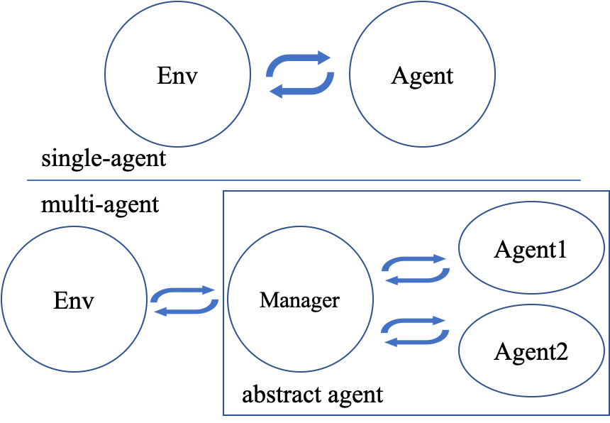

# PettingZoo

PettingZoo is the multi agent (**MA**) "extension" of Gym/Gymnasium.
For example for a Chess environment, maybe we organize ML competitions, and every submission is an agent, then we match agents and a board. Both agents should interact with the environment, each at their turn.

Maybe the game is simultaneous, like "Rock - Paper - Scissors". Both players place an action, only then both players get to see the outcome.

Another example for a MA environment can be a football game, where we have an agent for each of the player-robots. Even when we think of the solution as a single brain that controls all of its team players, it may still make sence to have a per-player action.

And so, with PettingZoo MA is doable.
A PettingZoo environment is not a Gymnasium environment, as the interface is a a bit different, yet the differences are simple to follow.
Just for illustration, and not necessarily what was choosen, consider for example, that instead of passing a single action to a 'step' function, one may need to pass a list of actions, or call 'step' multiple times, each time with an action per the current agent in a loop. We'll see the actual interface next.

PettingZoo makes Gymnasium its dependancy. Among other stuff, it takes from Gymnasium the definitions for the spaces.

There are two flavors from PettingZoo environments: Agent Environment Cycle (AEC) API, and Parallel API.

## Agent Environment Cycle (AEC) API

Below is an example from PettingZoo documentation.

``` py linenums="1"
from pettingzoo.classic import chess_v5
env = chess_v5.env(render_mode="human")

env.reset()
for agent in env.agent_iter():
    observation, reward, termination, truncation, info = env.last()
    if termination or truncation:
        action = None
    else:
        action = env.action_space(agent).sample(observation["action_mask"])  # this is where you would insert your policy
    env.step(action)
env.close()
```

We note that at line 5 we have an iteration over the current agents. The iteration value is a string representing the agent (its identification). This identification is used later to access, for example the action space (line 10). When we 'step' at line 11 we provide the action of the current agent.
We also see at line 6 that a call to 'env.last()' should return what the current agent sees (after a call for 'reset' was done done on the environment or another agent has just stepped).

We also see that for that specific environment 'chess_v5', an observation is a kind of a dict that has also the 'action_mask' key (line 10). For more information about 'action_mask' see [action masking](../../concepts/action_masking).

Note that as of the iteration, we may see the for example the following sequence: *A, B, C, A, B, C, A, B, A, B, D, ..* ('C' dissapeared after the second round, 'D' appeared at a later stage). For Chess we probably just have *player_0, player_1, player_0, etc..*

## Parallel API

For a parallel environment, at each round there are specific agents that need to act. All those agents act simultaneously. In next round we may see a different set of agents.

Here is the example from the documentation.

``` py linenums="1"
from pettingzoo.butterfly import pistonball_v6
parallel_env = pistonball_v6.parallel_env()
observations = parallel_env.reset()

while env.agents:
    actions = {agent: parallel_env.action_space(agent).sample() for agent in parallel_env.agents}  # this is where you would insert your policy
    observations, rewards, terminations, truncations, infos = parallel_env.step(actions)
```

## Implementing a PettingZoo Environment

If you want to implement a PettingZoo anvironment, it is a bit more involved than implementing a Gymnasium environment, as you need, for example, to keep the results of a 'step' call for a later 'last' call (for an AEC environment), or to maintain a mapping for an agent identity to an action_space (by implementing the 'action_space' function that takes an agent identity as an argument).

On the other hand, if you do have a turns-play "environment" it may make more sense to implement if first as a PettingZoo environment, even if you want to train a single agent. You can then "wrap" the MA environment and all the other agents, into a Gymnasium environment, and expose only what your agent needs to know and interact with.
I've done a similar thing, I'm going to describe it in [Wrapping a PettingZoo into a Gymnasium one](../wrapping_pz_into_gym). I've provided there "wrappers" that make your PettingZoo environment into a simple Gymnasium environment, to be used for example with Stable-Baselines3.

## Supporting Agents/Algorithms Libraries

Stable Baselines3 (SB3), is a go to package for Gymnasium environment. You can quickly try to train an agent to interact with an environment. SB3 is really simple and that would be my first go to. SB3 is kind of the 'scikit-learn' for RL. Unfortunatly, as far as I know SB3 does not support PettingZoo.

One good option to have a quick try with PettingZoo environment is to use Tianshou. I've tried Tianshou and it worked nice for me. It has a class *MultiAgentPolicyManager* that basically wraps one or more agent, and hence a policy of type Tianshou MultiAgentPolicyManager can interact with a PettingZoo environment.

<figure style="max-width: 60%">
  
  <figcaption>MARL following Tainshou (with MultiAgentPolicyManager)</figcaption>
</figure>

Tianshou is a little more involved than SB3, yet still reasonable. I plan to give a try also to RLLib, which is what a lot of people used those days. On my todo list...
Please note that with Tianshou MultiAgentPolicyManager we have a collection of agents, each with its own policy, and so only the (PettingZoo) environment is shared. There are algorithms that do want us to share some common "top-level" information among our cooperating agents.

As I've mentioned before that I've implemented a wrapping mechanism that turns a PettingZoo environment into a Gymnasium one. This can be used when you have already an implementation of a Chess player for example, or maybe want to beat a random agent, and then maybe bootstrap each round of a turnament againt the previous version of your agent (self-play). With the PettingZoo to Gymnasium wrapper functionality available in [quertyenv](https://github.com/zbenmo/qwertyenv), one can even use SB3. My "trick" was to provide in the initialization of the environment a callable that is basically the implementation of the other agent(s) "predict" method (AKA "act" method).